<strong><code>pranshi2300@github ~ $ ./contributions.sh</code></strong>

---

# 💻 Tech Stack:
                                           
# 📊 GitHub Stats:

 

---

<!-- Proudly created with GPRM ( https://gprm.itsvg.in ) -->
